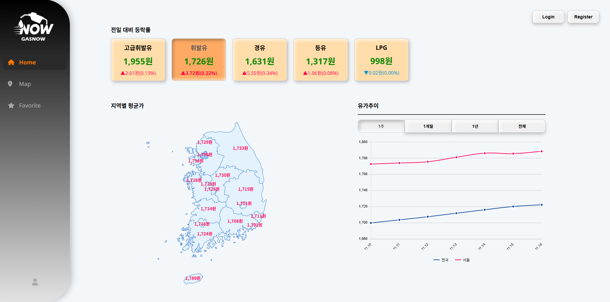

# ⛽️ GasNOW  실시간 전국 주유소 검색

> API를 활용하여 실시간 유가 및 주유소 정보를 조회하는 프로젝트입니다.
<br>https://3.38.154.32:8443/

<br>

# 메인 화면
* 전국 전일 평균가 대비 현재 평균가 변동률을 알 수 있는 유종별 데이터를 제공합니다. 
* 전국/지역별 유가 추이를 한눈에 볼 수 있는 차트와 지도를 제공합니다.

<br>



<br>

### 주요 기능
* **지도:** 대한민국 지도 <SVG> 태그를 사용해 지역별 현재 평균가를 지도 위에 표시합니다.
* **차트:** Chart.js를 이용해 1주/1개월/1년/전체 기간 단위로 DB에 저장된 유가 변동을 시각화합니다.
* **실시간 현재가:** Opinet (유가 정보 API) 데이터를 연동하여 전국 현재 평균가를 조회하고, DB에 저장된 전일 평균가와의 변동률을 보여줍니다.
* **유종별 검색:** 고급휘발유, 휘발유, 경유, 등유, LPG를 선택하여 지도와 차트 기능을 해당 유종으로 조회합니다.

<br>
<br>

# 지도 / 상세조회 / 즐겨찾기
* 현재 위치 기준 반경 5km 내 모든 주유소를 거리순/가격순으로 조회하는 지도를 제공합니다.
* 주유소 클릭 시 해당 주유소의 상세 정보 및 즐겨찾기, 후기 기능을 제공합니다.

<br>


<br>

### 주요 기능
* **지도:** 
* **주유소 상세조회:** 현재 위치 기준으로 조회한 주유소 클릭 시 해당 주유소의 고유 번호로 API 조회하여 상세 정보를 제공합니다.
* **리뷰/즐겨찾기:** 주유소 상세조회 창에서 즐겨찾기 등록한 매장을, 그리고 리뷰 버튼으로 선택한 평점을 DB에 저장합니다.
* **즐겨찾기 조회:** DB에 로그인 계정으로 저장된 즐겨찾기 등록된 매장을 조회하여 지도에 표시합니다.

<br>
<br>

# 회원가입 / 로그인 / 마이페이지
* 로그인 계정으로 즐겨찾기 설정한 매장들을 한 곳에서 조회 가능합니다.

<br>


<br>

### 주요 기능
* **회원가입:**
  ID, 연락처 중복 확인 및 유효성 검사
  정규 표현식과 일치하는 비밀번호 유효성 검사 및 암호화
  JavaMainServer를 이용한 이메일 인증번호 기능
* **로그인:** 입력한 정보가 유효한 지 확인하고, ID 저장 버튼 선택 시 쿠키에 30일 간 저장합니다.
* **마이페이지:** 로그인 회원만 접근 가능하도록 인터셉터와 WebConfig 설정하고, 리뷰/포인트/회원정보 변경/탈퇴 기능을 제공합니다.
* 

<br>
<br>
<br>

## 🛠️ 기술 스택

* **Frontend:** HTML, CSS, JavaScript, Chart.js
* **Backend:** Spring Boot, Java
* **API:** Opinet API
* **DBMS:** MySQL
* **Tool:** IntelliJ IDEA, GitHub, Figma, notion, MySQL Workbench
* **Server:** AWS(Amazon Web Services)
* **OS:** Windows, MacOS

<br>

## ⚙️ 설치 및 시작하기

```bash
# 1. 저장소 복제
git clone [https://github.com/your-id/oil-now.git](https://github.com/your-id/oil-now.git)

# 2. (Frontend) 의존성 설치 및 실행
cd frontend
npm install
npm start

# 3. (Backend) 실행
# (백엔드 실행 방법을 여기에 적습니다)
