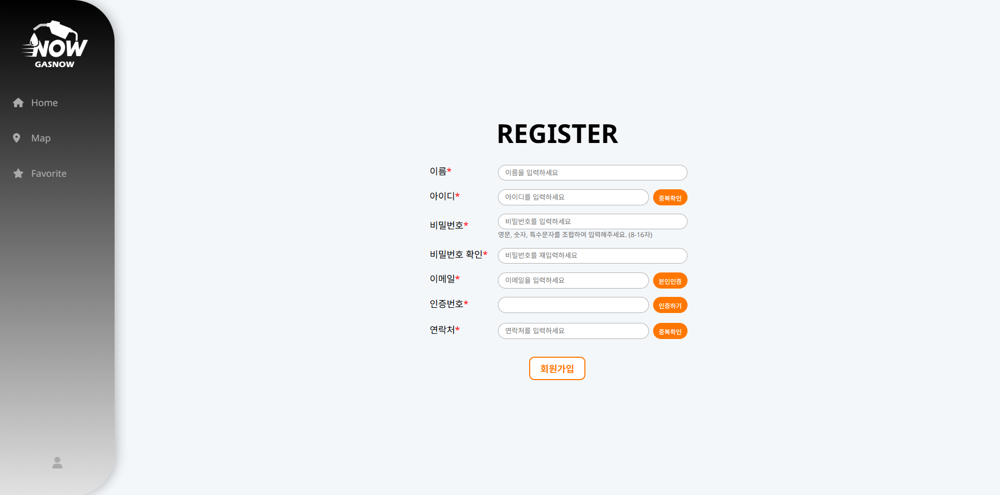

# ⛽️ GasNOW 위치 기반 주유소 검색
<div align="center">
    <a href="https://gasnow.store ">
        
    </a>
</div>

<p align="center">
  <b>API를 활용한 실시간 인근 주유소 검색 서비스</b>
  <br/>
  <a href="https://gasnow.store "><strong>Visit GASNOW »</strong></a>
</p>

---

# 💡프로젝트 소개
**GASNOW**는 오피넷 API를 활용하여 지도 상에서 현 위치를 기준으로 인근 주유소를 보여주고,
유가 관련 인사이트를 제공하는 웹사이트입니다.


<br>

# 메인 화면
* 전국 전일 평균가 대비 현재 평균가 변동률을 알 수 있는 유종별 데이터를 제공합니다. 
* 전국/지역별 유가 추이를 한눈에 볼 수 있는 차트와 지도를 제공합니다.

<br>

# 🔅 주요 기능

## 🏠 Home 대시보드
#### 실시간 현재가
* 오피넷의 유가 정보 API 데이터를 연동하여 전국 현재 평균가를 조회하고, DB에 저장된 전일 평균가와의 변동률을 보여줍니다.
#### 전국 평균 유가 지도
* \<SVG> 태그를 사용해 지역별 현재 평균가를 지도 위에 표시합니다.
#### 기간별 유가 변동 시각화 차트
* Chart.js를 이용해 1주/1개월/1년/전체 기간 단위로 DB에 저장된 유가 변동을 시각화합니다.
 


## 📍 지도 / 상세조회 / 즐겨찾기
#### 주유소 검색
* 현재 위치를 기준으로 반경 5km 이내의 주유소를 검색해 지도 상에서 보여줍니다.
#### 주유소 상세조회
* 현재 위치 기준 반경 5km 내 모든 주유소를 거리순/가격순으로 조회하는 지도를 제공합니다.
#### 즐겨찾기 조회
* 주유소 클릭 시 해당 주유소의 상세 정보 및 즐겨찾기, 후기 기능을 제공합니다.


## 👦 회원가입 / 로그인 / 마이페이지
* 로그인 계정으로 즐겨찾기 설정한 매장들을 한 곳에서 조회 가능합니다.
#### 회원가입
* ID, 연락처 중복 확인 및 유효성 검사를 실시합니다.
* Bcrypt 알고리즘을 활용해 비밀번호를 암호화하여 DB에 저장합니다.
* JavaMailServer를 이용해 이메일 인증번호를 발송합니다.
#### 로그인
* 아이디 저장 체크 시 쿠키에 사용자 아이디가 30일간 저장됩니다.
#### 마이페이지
* 로그인한 회원만 접근할 수 있도록 WebConfig를 설정하여, 비회원 접근 시 자동으로 로그인 페이지로 이동합니다.
* 리뷰 내역/포인트 내역/회원정보 및 비밀번호 변경, 로그아웃, 회원 탈퇴 기능을 제공합니다.

<br>




<br>

## 🚀️ 기술 스택
### **Frontend**


### **Backend**


### **API**


### **Database**


### **Tools**


### **Server**


### **Operating System**


## 🧑‍💻 역할 분담 - 전원 풀스택

| 역할                                | 이름   | GitHub |
|:----------------------------------|:-----| :--- |
| 👨‍💻 **Map**                     | 김재민  | [@andrew00874](https://github.com/andrew00874) |
| 👩‍💻 **Home(index)**             | 박세원  | [@svv0003](https://github.com/svv0003) |
| 👨‍💻 **Login, Register, Mypage** | 오유성  | [@Emma10003](https://github.com/Emma10003) |
| 👨‍💻 **Map, Favorite**           | 현윤선  | [@yunseonHyun](https://github.com/yunseonHyun) |


## ⚙️ 설치 및 시작하기

```bash
# 1. 저장소 복제
git clone [https://github.com/your-id/oil-now.git](https://github.com/your-id/oil-now.git)

# 2. (Frontend) 의존성 설치 및 실행
cd frontend
npm install
npm start

# 3. (Backend) 실행
# (백엔드 실행 방법을 여기에 적습니다)
